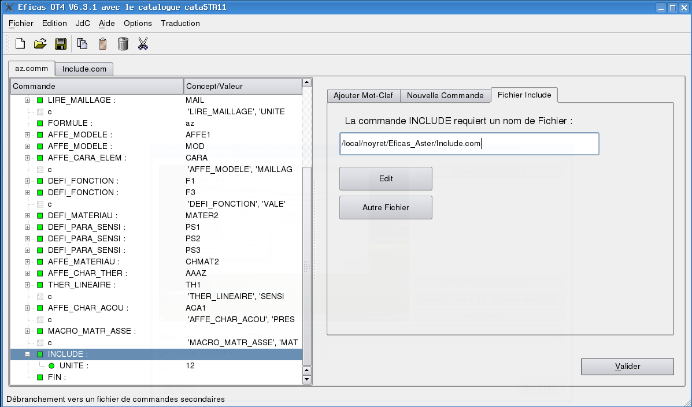

EFICAS for Aster
================

INCLUDE, INCLUDE_MATERIAU and POURSUITE macros have a special behaviour.
the concepts produced by these macros are created by a separated exec (in  python sense) of the corresponding (also separated) command file. They are then included in the context of the main command file. 
This processing (including in the main JDC the concepts created in INCLUDE, POURSUITE) is almost completely automatic. But, in some particular case, you can have unexpected difficulties.   

Principles are :

1- Eficas doesn't take account of an invalid file even if some of the commands are completed. 

2- You are able to edit the content of the included file. 

3- Included files are knowned by Eficas according to their UNITE for INCLUDE, according to the materiel(?) 's name. (A file can only have one POURSUITE). so take care not to use the same number UNITE for differents INCLUDE : otherweise, rereading will exec the same file for differents INCLUDE. 

4-  Push the button "Autre Fichier" to command Eficas to change the included file. Using this method, you can force an invalid file to be read and use the valid concepts it includes.   

5- a INCLUDE file can own its INCLUDE file and so weiter... All the concepts can be accessed from the main file and all englobing files.

5- file's name for INCLUDE_MATERIAU command is build according to the parameter values of the command. Eficas neither asks the user to give its name.

6- The user is also able to edit simultaneously a JDC and all its POURSUITE or INCLUDE files. Most of the time, modifications will be propaged to the main JDC. However, it could be possible that some errors occurs. In case of doubts, the user should ask about the error reporting ('Rapport de Validation' in JdC Menu) to know more and correct the problem. Reopening files should also be an issue. 
