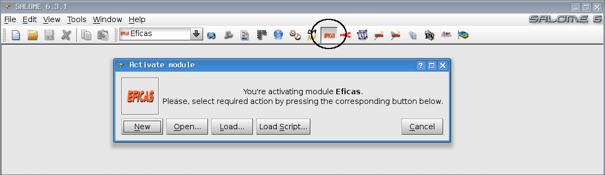
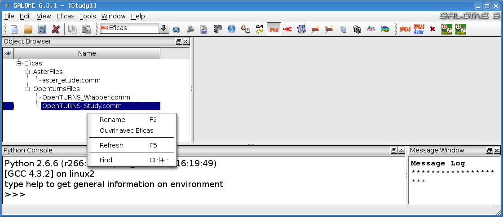
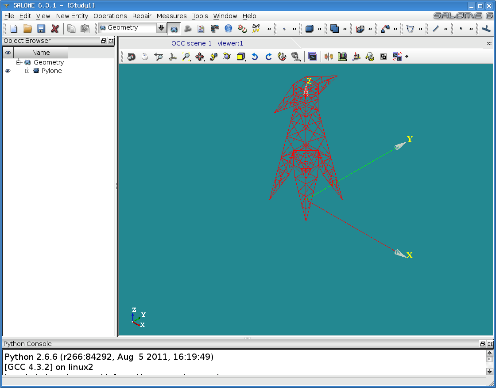
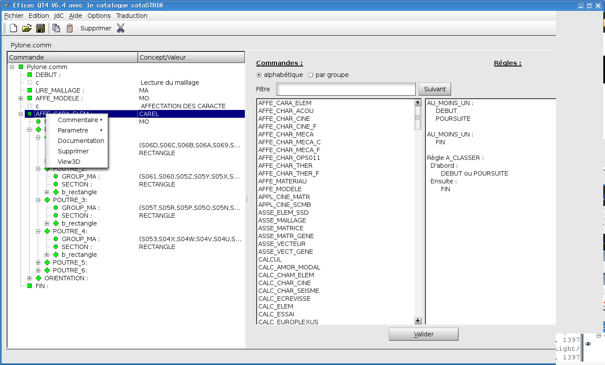
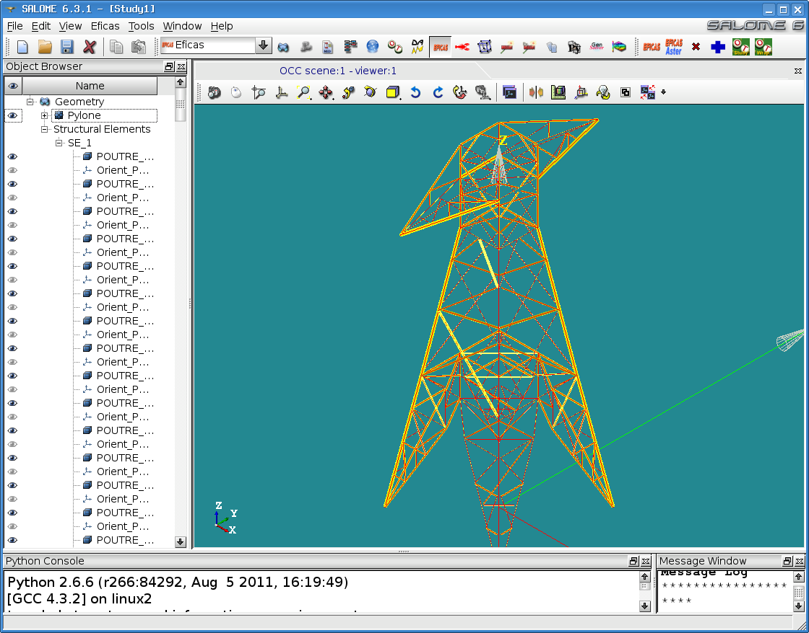

EFICAS in Salome
=================

Launching EFICAS in Salome
---------------------------
first activate EFICAS module

Use EFICAS. When a file is saved, Eficas will create an associated entry in the object browser.
It is possible to user the file in other modules (see appropriate module's documentation).

Structural Element (for Aster)
------------------------------

Eficas is able to create "structural element" in GEOM or in SMESH in order to
validate data.  

- Create your geometry

- Create your eficas JDC, and define for example a beam 

- Click on "View3D". Eficas shows you the result in GEOM and creates "beams" .
  be aware : these "structural element" are not Geometry elements (You can't use it)
  It's also possible to verify normals orientation.

