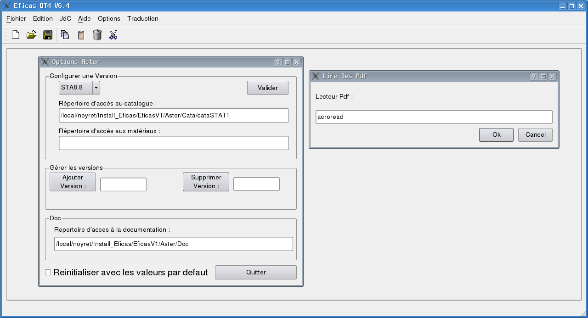

your own custom EFICAS
======================

User can choose to custom Eficas. They can decide which catalogs they used
and which pdf reading tool they prefer. 
For some codes, they also can choose where their files will be saved.

- example : for Aster

a file editeur_salome.ini is created in .Eficas_CODE ( for example .Eficas_MAP) in user's home directory.

