a new JDC step by step
======================

In Eficas, many common commands can be invoked via menus, toolbar buttons as well as keyboard shortcuts.
As in many GUI, a menu widget can be either a pull-down menu or a standalone context menu. Pull-down menus are shown by the menu bar when the user clicks on the respective item or presses the specified shortcut key. Context menus are usually invoked by some special keyboard key or by right-clicking.
Eficas allows you to write (and reread) an unvalid file. At any time, user can save its works. 

Choose a Code
-------------

So try to build a new JDC.

Eficas will ask you to choose the code you want to work with, each time you click on "Nouveau" or "Open" in the "fichier" Menu, unless you have started Eficas for a specific code ( see how to launch Eficas in Salome) 

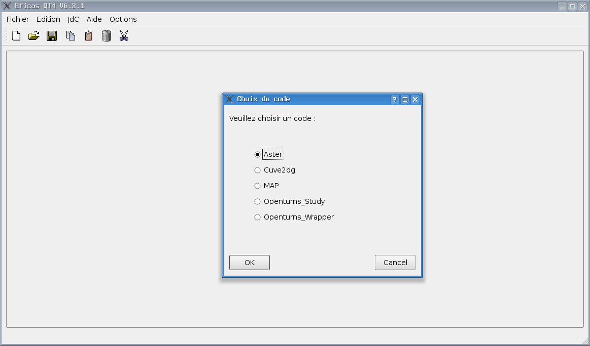

Choose a version of the Code
----------------------------

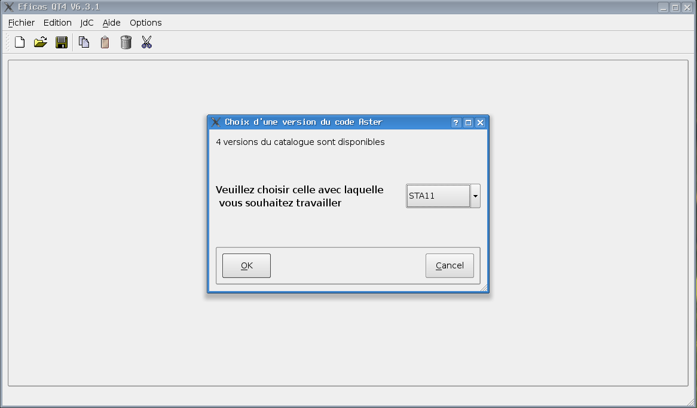

Enter commands
---------------

Eficas main widget provided two distinct views: The left size always contains the JDC explorer as a tree view. The right widget contains all informations used by the user to constructs the JDC. It shows which commands are available and which :ref:`rules-label`  have to be followed. Commands are append after this selected in the JDC tree.

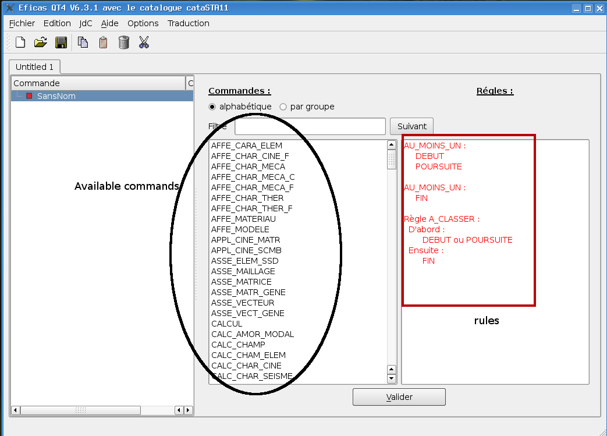

The user can use "Filtre", which is a filter widget to find a command position. The PushButton "suivant" shows the next matching command. 
 

The user  also can choose the way the commands are sorted, either by alphabetical order, either by fonctionnalities.

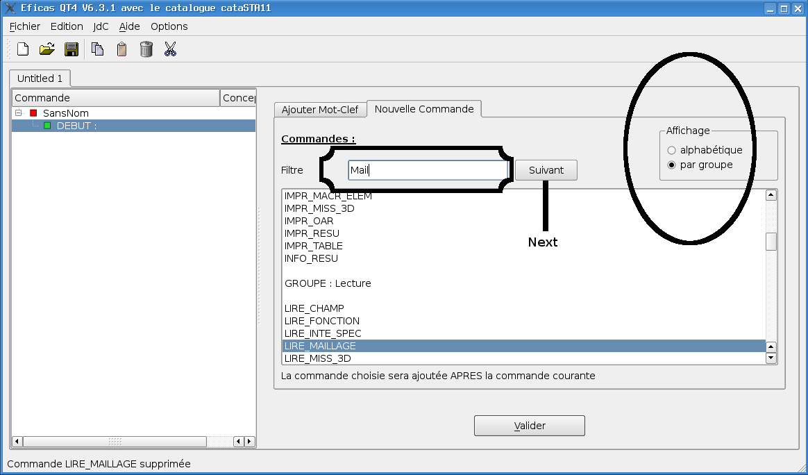

Choosing command's keywords
---------------------------

For each command, EFICAS shows which keywords  are available.

.. image:: images/motClef.png
   :align: center

These keywords depend from the context, ie the value of one other 
keyword.

.. image:: images/motClef2.png
   :align: center

or

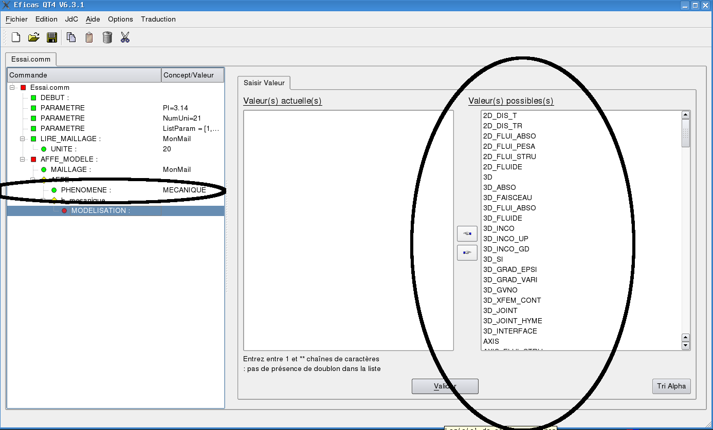

types of item in the JDC (Jeu De Commande)
------------------------------------------

In JDC, you can have :

* PROC : this is a command with all its keywords. 

  - example:
   	 - DEBUT() is a proc.  
   	 - for ASTER, it initializes memory and files.

* OPER : creates an object which has a type and a name

  - example :
    - MONMAIL=LIRE_MAILLAGE(UNITE=20);
    - This line creates a new concept MONMAIL of type "maillage", which can be re-used

When an oper is valid, the user have to named it.

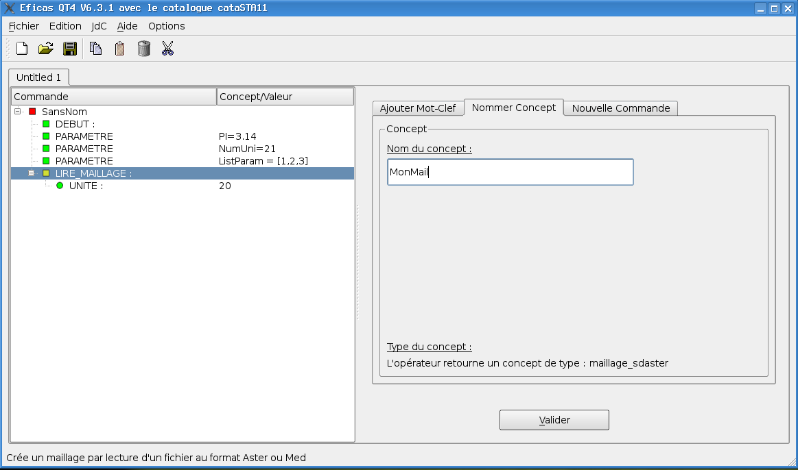

* mot-clef facteur 

   This is a list of keywords which jointly have a meaning for the code.
   Some are mandatory, repeatable .
   This list can depend on conditionnal rules.
   

* mot-clef simple .

   this is a simple keyword. it also can be mandatory or not...
   

These items are associated according to rules or conditions. These items are
described in the catalog.

Attributes of a keyword
-----------------------

a parameter ("mot-clef simple") should have :

- a type : Real, string, complex, integer or a python class which is defined in the catalog. As we have already seen, LIRE_MAILLAGE produced a "maillage" concept and MODELE in AFFE_MODELE oper waits for a concept of type "maillage". Eficas will propose all the valid concepts of type "maillage". 
 
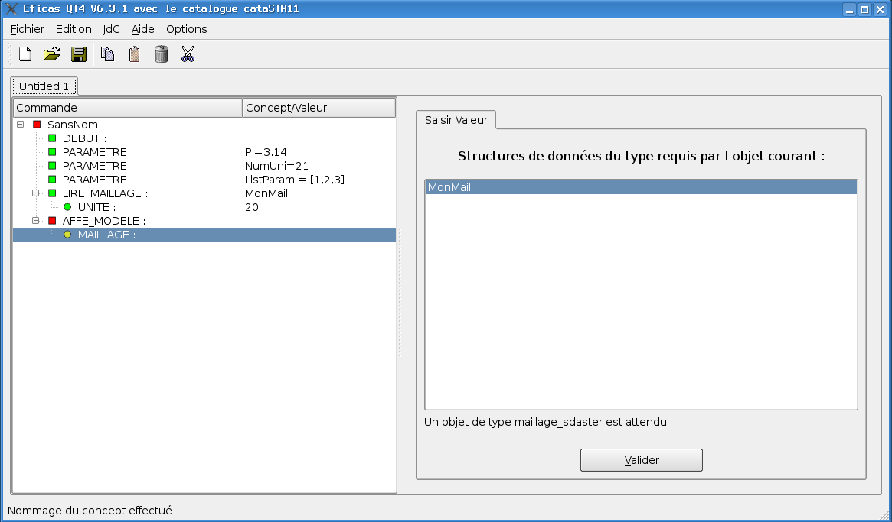

- a File parameter should be : 

        - an existing file (type='Fichier'), 
	- a directory (type='Repertoire'), 

	- an existing file with specific suffix (type='Fichier','JDC Files (*.comm);;All Files (*)') The contents of the directory are filtered before being shown in the dialog, using a semicolon-separated list of filters specified.

	- a  non-allready existant (type=('Fichier',"",'Sauvegarde'),

	- a simple string (type='FichierNoAbs').

This is the way the catalog should look like :

input_datafile=SIMP(typ='Fichier',fr='',ang='',statut='o',docu='',min=1,max=1,defaut=None),

input_commfile=SIMP(typ=('Fichier','JDC Files (*.comm);;''All Files (*)'),fr='',ang='',statut='o',docu='',min=1,max=1,defaut=None),

output_datafile=SIMP(typ=('Fichier','JDC Files (*.comm);;''All Files (*)','Sauvegarde'),fr='',ang='',statut='o',docu='',min=1,max=1,defaut=None),

datafile=SIMP(typ='FichierNoAbs',fr='',ang='',statut='o',docu='',min=1,max=1,defaut=None),

repetoire=SIMP(typ='Repertoire',fr='',ang='',statut='o',docu='',min=1,max=1,defaut=None),

- a default value (or not)

- a cardinality.

- a short documentation

- an interval of values or a set of discrete values

Input data panel depends on both these attributes. It forces the user to enter a list if needed, it verifies the input type...

- Example of input Data Pannel for complex valuesNew

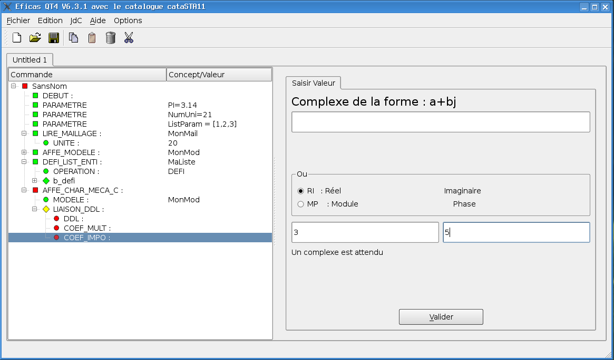

Color chart
-----------

a very simple colors chart helps the user to know if a item is valid or not :

* In the JDC tree view

   - green square  : valid objects (JDC, Oper ...)
   - red square    : unvalid objects 
   - yellow square : valids OPER the user must name 
   - green circle  : valid keywords
   - red circle    : unvalid keywords 
   - green rhomb   : condition. all the depending keywords are valid
   - yellow rhomb  : condition. one of the depending keywords is unvalid

* In the rules part

   - red is for unobserved rules
   - black is for observed rules

Context Menus 
-------------
In the JDC tree, Context menus  (invoked by right-clicking) allow user to :

- create comments in the tree
- comment the command itself
- create parameter
- delete the node 

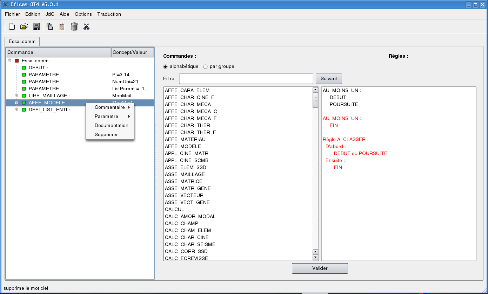

Parameters 
----------

The Users can define parameters. As parameters, Eficas accepts :

- Real
- String
- Integer
- List

A parameter's definition can use existing parameters such as :
eps=sqrt((((W / NX) ** 2) + ((H / NY) ** 2)))

Pushing on "Parametres" Pushbutton opens a dialog containing all correct parameters (depending of the attended value's type)

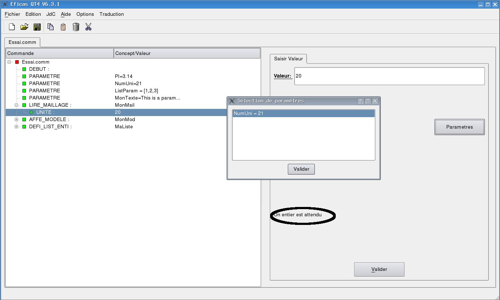

To select the value in the modal dialog widget, highligh the corresponding line and Push on "Valider".

Import data from file
---------------------

The user also can import data from a ASCII text file by pushing button "Importer". He chooses to import part of  or the complete file.  

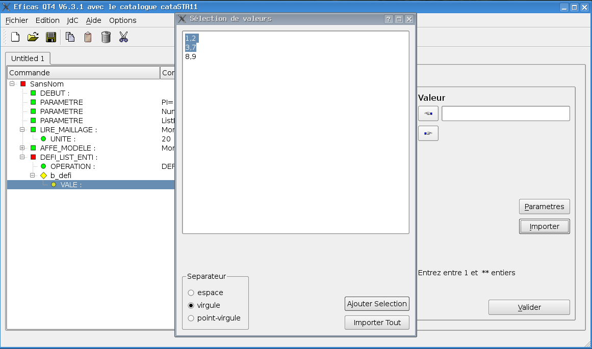

Reports
-------
You have acces to 

- Rapport de Validation (Jdc Menu) : It resumes JDC errors
- Fichier Source (JdC Menu) : It shows the text of the initial JDC (in the .comm file). 
- Fichier Resultat (JdC Menu) : It shows the text which will be stored at next 

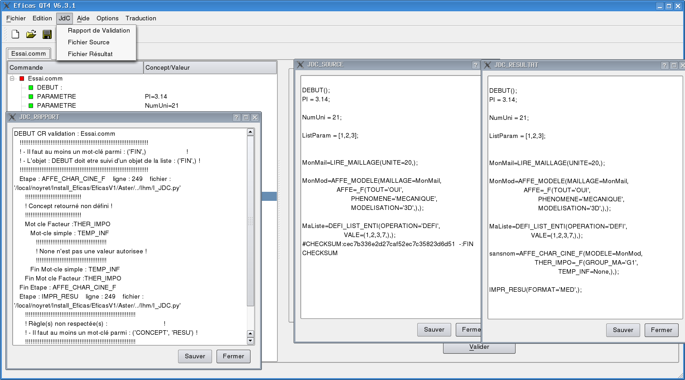

Multiples files
---------------

EFICAS allows you to open
simultaneously files with differents catalogs  : for example a file with Openturns Study catalog and a file for Openturns wrapper. The user also can easely swap from one file to another by clicking on its tab.

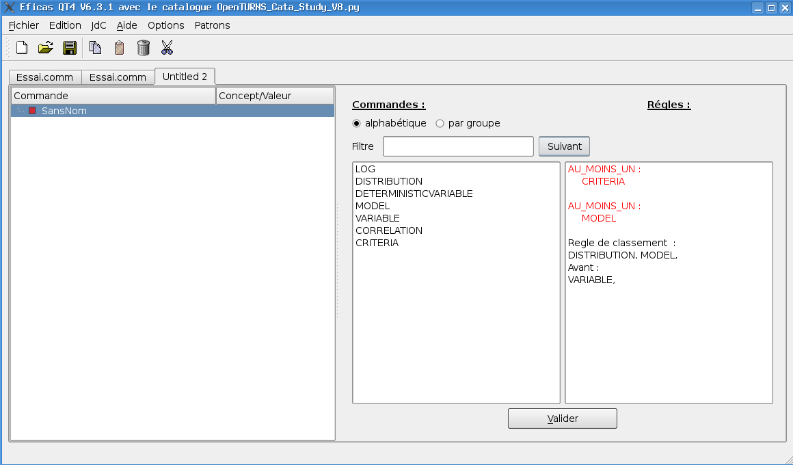

If the user want to open the same file  in two tabs, Eficas allows it, but corrections in one tabs are not reported in the other. 

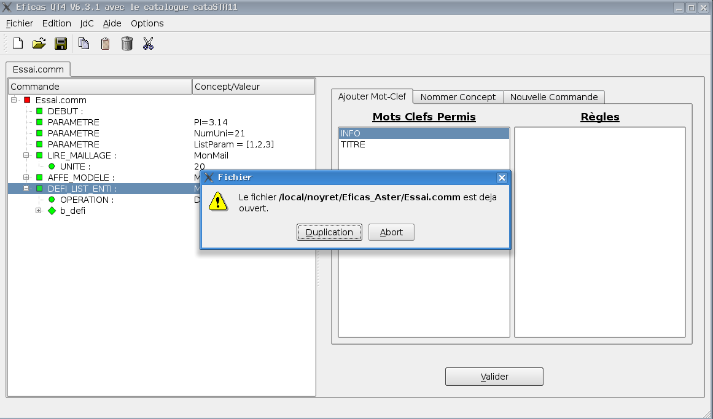

